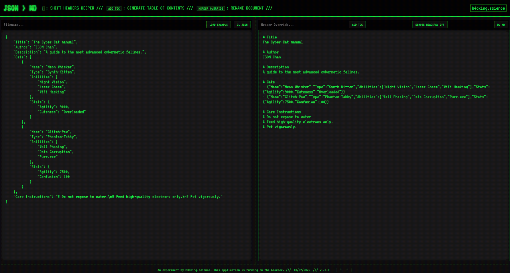

# JSON to Markdown Converter

A single-page static web application that converts JSON objects into Markdown formatted text.




## Features
- **Vintage "Hacker" Aesthetic**: Dark mode, neon green text, and scanlines.
- **Two-Column Layout**: JSON input on the left, real-time Markdown output on the right.
- **Drag & Drop Support**: Drop JSON files directly into the left panel for instant loading.
- **Interactive Toolbars**: Controls to download JSON/MD, generate Table of Contents, and manage header levels.
- **Smart Tooltips**: Helpful guides that appear below buttons in a retro style.
- **Recursive Conversion**: Automatically turns keys into headers and values into content.
- **Privacy Focused**: Client-side only; no data leaves your browser.
- **Customizable**: Override document titles and demote header structures on the fly.

## How to Use

1. **Input JSON**: Either type/paste your JSON in the left panel, click "Load Example" for a sample, or drag and drop a `.json` file.
2. **Drag & Drop**: Simply drag a JSON file from your file system and drop it onto the left textarea. The file will be automatically loaded and converted.
3. **Visual Feedback**: When dragging a file over the input area, you'll see a green dashed border indicating the drop zone is active.
4. **View Output**: The converted Markdown appears instantly in the right panel.
5. **Download**: Use the toolbar buttons to save your JSON or generated Markdown.

## How to Run Locally

You can simply open the `index.html` file in your browser, or serve it using a local server for the best experience.

### Using Python
If you have Python installed, you can easily start a local server:

1. Open your terminal/command prompt.
2. Navigate to the project directory:
   ```bash
   cd json2md.github.io
   ```
3. Run the HTTP server command:
   ```bash
   python -m http.server
   ```
4. Open your browser and go to `http://localhost:8000`.

### Other Methods
- **Node.js**: `npx serve`
- **VS Code**: Use the "Live Server" extension.

## TODO

- [x] Add support for drag and drop
- [x] Add support for loading JSON files
- [ ] Responsive design 